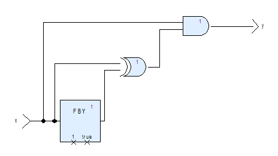
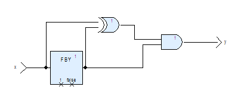
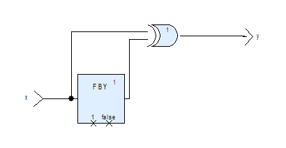
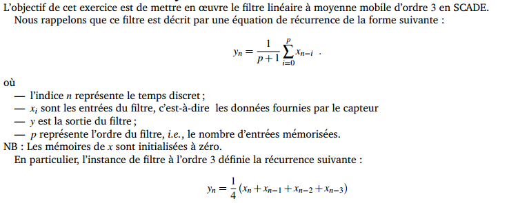
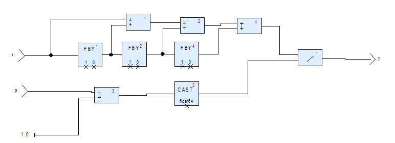
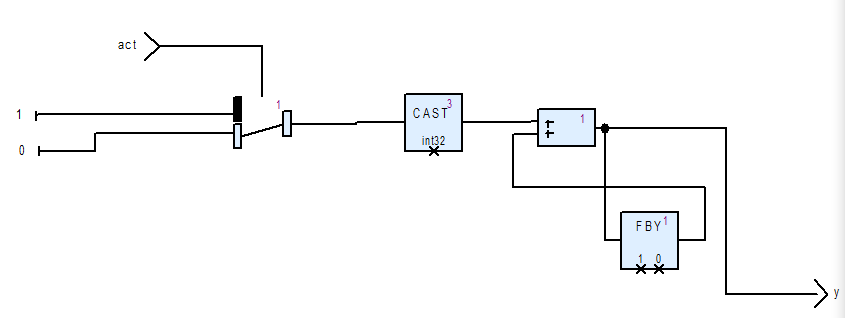

# TP1

## 1 Detecteur de fronts montants et fronts descendants

### 1.1 fronts montants

### 1.2 fronts descendants

### 1.3 Both

## 2 Filtre a moyenne mobile

### 2.1 order=3

## 3 Compteur

